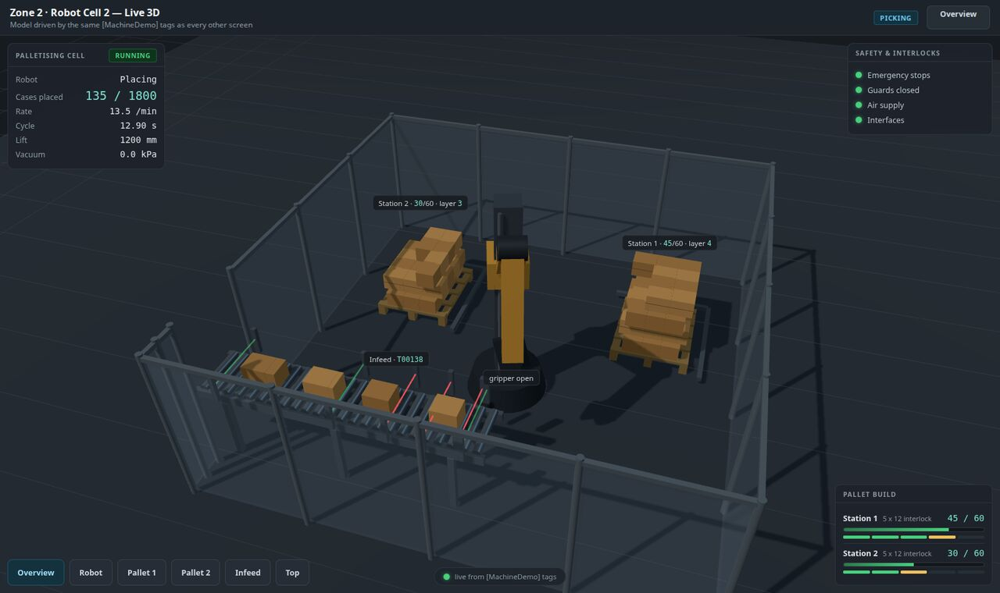
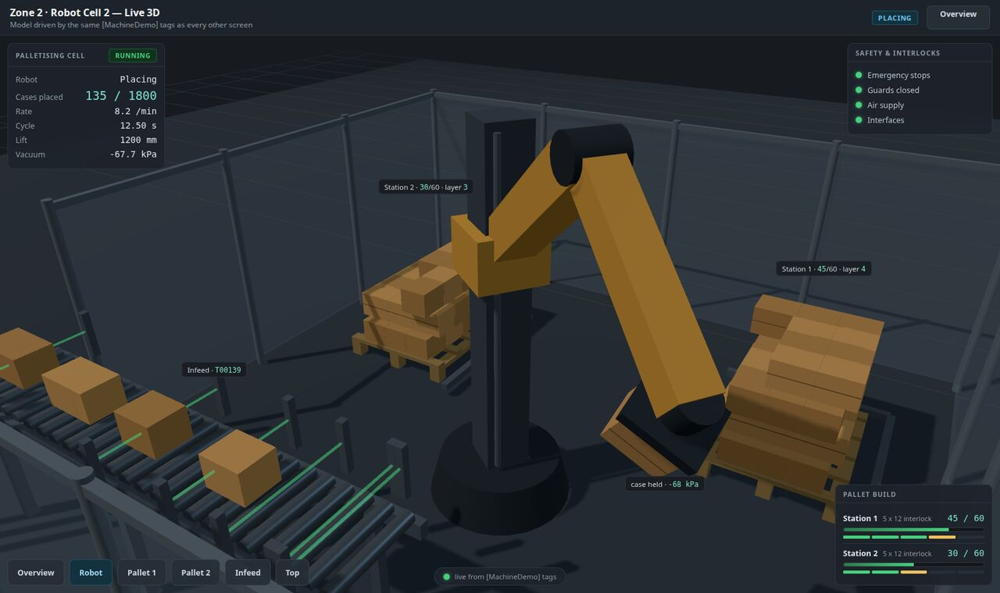
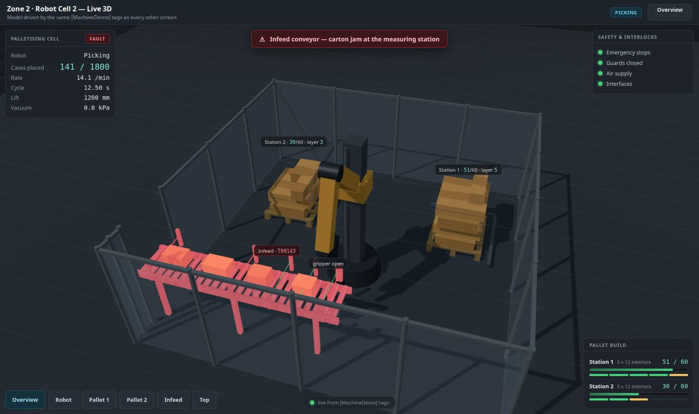

# Machine HMI Demo

**Machine-level operator control in Ignition Perspective — including a live 3D
model of the cell — for machine builders evaluating Ignition as an HMI
replacement.**

It exists because of a criticism that comes up whenever someone meets Ignition
for the first time from the machine-builder side: the demonstrations are all
*dashboard-like*, and none of them look like the screen an operator stands in
front of at the machine.

That is fair, and it is not answered by argument. This is the answer instead: a simulated robotic palletising cell
with the screens an operator and a fitter would actually stand in front of — a
line overview, manual control with permissives and hold-to-run jog, an alarm
page, and a 3D view of the machine driven by the same tags as everything else.

Every screen runs on **Ignition Edge Panel** as well as the standard platform.
On a gateway that can have a database, the demo brings its own with it: **a
SQLite file beside the gateway**, made by the same one button, with no server
to stand up, no credential and no config scan. Edge Panel has **no database
connectivity at all** — not merely discouraged, the module that provides it is
not part of the Edge build — so on Edge that same button configures Edge's own
internal alarm journal instead: alarms are still journalled either way, and
removing the demo is still deleting nothing but its own resources.

---



*The 3D cell inside a Perspective page. The header and the state chip are
Perspective components bound to tags; the scene below is a WebGL page served by
this project's own WebDev resource. Both pallets build in a real 4x3 interlocked
pattern because the robot is genuinely placing cases.*



*The arm follows five joint tags and a lift position, solved by real inverse
kinematics in the simulator, and is holding a case at -68 kPa of vacuum. Photo-eye
beams along the infeed glow green while clear.*



*One button injects a conveyor jam. The infeed pulses red **in the model**, the
banner names it in plain words, and the cell status flips to FAULT — so a fitter
knows where to walk before reading anything. That is the argument for 3D on a
machine screen: not that it looks impressive, but that **location is
information**.*

---

## What it demonstrates

| | |
| --- | --- |
| **3D model rendering** | A palletising cell — robot, infeed, two pallet stations, guarding — animated from live tags. Camera presets, orbit and pinch-zoom for a touch panel, faults highlighted on the geometry itself. |
| **Access control by security zone** | The same Manual screen is fully live for maintenance and visibly read-only for an operator, with the reason stated on screen rather than silently disabled. |
| **Alarming** | Alarm status and journal tables on the demo's own tag provider, its own SQLite connection and its own journal profile — acknowledge and shelve included. The alarm page shows this machine only, and the history lives in the demo's own file with its own retention. |
| **Your own CAD on a screen** | A second, separate page loads plain **STL** files straight off the gateway and lets an operator orbit, zoom, pan and click a part to identify it — no module, no licence, no internet. Drop the files in the project's `cad` resource folder and rescan; see [docs/CAD-VIEWER.md](docs/CAD-VIEWER.md). |
| **Operator control** | Hold-to-run jog, a permissive list that answers "why won't it move?", service routines, and per-zone start/stop. |

## Install

Import `build/Machine_HMI_Demo-<version>.zip` in the Designer, then open the
**Setup** page and press one button. Setup writes 112 tags and 11 alarms into
its own `MachineDemo` tag provider and starts the simulator the same way on
every edition. What it does about a database depends on what the gateway can
actually do:

- **Standard Ignition (or Maker)** — setup also creates the demo's own
  `MachineDemoDB` SQLite connection and a `MachineDemo` alarm journal that
  writes into it, exactly as before.
- **Ignition Edge Panel** — has **no database connectivity at all**: not
  merely discouraged, the SQL Bridge module that provides it is simply not
  part of the Edge build, and machine specifications routinely rule databases
  out entirely. Setup detects this (there is no `database-connection`
  resource type registered — see `_hasDatabaseModule` in
  `MachineDemo.setup`) and does not attempt one. Instead the `MachineDemo`
  alarm journal is configured as Edge's own **LOCAL** profile: alarms are
  still journalled and the Alarms screen still has history to show, with no
  datasource anywhere.

On **Edge** the demo adopts what Edge already has rather than creating its own:
Edge permits exactly one tag provider and one alarm journal, so setup uses
them and says so. Measured against a real Edge Panel gateway — see
[docs/CONTRACT.md](docs/CONTRACT.md).

All of it through `system.config` and `system.tag.configure`, so there is no
config scan, no restart and no credential: SQLite (where it is used at all)
is a file under the gateway's data directory, and the connection has no
username and no password to hold.

Headless equivalent — from the Designer's Script Console (Tools → Script Console),
which runs as your signed-in Designer session:

```python
MachineDemo.setup.run()     # install or repair; safe to repeat
MachineDemo.setup.check()   # the eight install rows
```

`curl "http://<gateway>/system/webdev/Machine_HMI_Demo/admin?cmd=check"` reads the
same rows over HTTP. HTTP is **read-only** on this project: setup, like every other
write, is refused with 405 over HTTP on purpose (see *Driving it in a meeting*).

`?cmd=setup` is safe to repeat: every step is an upsert, and on a gateway that
already has everything it creates nothing and reports the same counts.

### What `?cmd=check` reports on each edition

The eight rows (`tagProvider`, `tags`, `udt`, `config`, `alarms`, `database`,
`journal`, `simulation`) are the same on both editions, but two of them read
differently:

| Row | With a database (standard / Maker) | Ignition Edge Panel |
| --- | --- | --- |
| `database` | green — `MachineDemoDB` exists and answers `SELECT 1` | green — **"not applicable on this edition"**; no connection is attempted |
| `journal` | green — `MachineDemo` is a `DATASOURCE` profile writing into `MachineDemoDB` | green — `MachineDemo` is Edge's own `LOCAL` profile; alarms are kept, no datasource anywhere |

Neither row goes red for being on Edge. A row only goes red if the
edition-appropriate configuration is actually missing or wrong — a stray
`DATASOURCE` journal left on an Edge gateway (or a `LOCAL` one on a gateway
that does have a database) reports red until `fix` runs again.

Both are measured. The with-database branch runs against a standard Ignition
gateway; the no-database branch was measured on a **real Edge Panel gateway** on
09/09/2026, where the eight rows read green from one press of RUN SETUP.

## Installing on Edge

There are **two release zips**. Edge permits exactly one realtime tag provider
and it is called `edge` out of the box, so the Edge build is the same project
with the provider name substituted at build time — it adopts what Edge already
has instead of renaming anything on the gateway.

| Gateway | Zip |
| --- | --- |
| Standard Ignition, Maker | `Machine_HMI_Demo-<version>.zip` |
| Ignition Edge Panel | `Machine_HMI_Demo_Edge-<version>.zip` |

**There is no project import on Edge** — the button renders, and
`POST /data/api/v1/projects/import/...` answers **403** with nothing in the log.
Install by copying the unzipped project over Edge's own project folder
(`data/projects/Edge/` by default), `chown` it to the gateway user, then
Config → Platform → Projects → **Scan File System**.

One gateway setting has to change first, and it cannot be done from the project:
Config → Platform → **Ignition Edge** → **Visualization Module** ships set to
**Vision**, and until it is Perspective no Perspective session will open at all.

Then open the Setup page and press **RUN SETUP**. Nothing else — no provider
rename, no restart, no config-resource editing. Verified on a fresh Edge
gateway, including across a restart.

## Driving it in a meeting

The Setup page doubles as a presenter console, and it is the way to drive the
demo: its buttons call the `MachineDemo` library in-process, as the signed-in
Perspective session, so they need nothing configured and no second window.

HTTP is read-only, and that is the security pillar made literal: nobody on the
network can open the guard circuit or jog the arm with a URL, with or without a
credential, because there is no write path to guard.

| | Verb | Result |
| --- | --- | --- |
| `state` `status` `version` `check` `faults` `alarms` `alarmcheck` | GET | open — the 3D page polls `?cmd=state` from an iframe |
| `setup` `fix` `fault` `clear` `reset` `speed` `mode` `jog` `guards` | GET | **405** `writes are not accepted on GET` |
| anything | POST | **405** `writes are not accepted over HTTP` |

The second way to drive it, when the Setup screen is not on the screen you are
sharing, is the Designer's Script Console:

```python
MachineDemo.api.setFault("ConveyorJam", True)   # also WrapperFilmFeed VacuumLow GuardOpen RobotAxisFault
MachineDemo.api.setFault("ConveyorJam", False)
MachineDemo.api.reset()                         # back to steady state
MachineDemo.api.setSpeed(2)                     # simulation speed
MachineDemo.api.setMode("Auto")                 # hand the cell back to the auto cycle
```

## How the 3D page works

Perspective has no native 3D component, so the scene is a WebGL page served by
this project's own **WebDev** resource and shown in Perspective's inline-frame
component. It polls `?cmd=state` and interpolates between updates.

**three.js is vendored inside the project**, served from
`webdev/resources/lib/three.min.js` by a path resolved from the gateway's own
install directory — so it works on an air-gapped machine, which is the normal
condition for the panels this is aimed at. `tools/package.sh` fails the build if
that file is ever missing from the zip.

Because it is all inside the project, importing the project is the entire
install. There is no CDN, no extra module and no second file to place.

The page labels itself — a quiet "Ignition WebDev · three.js · not a
Perspective component" across the top — because it is styled to match the rest
of the project closely enough that nobody can tell otherwise, and in a
demonstration that is exactly the fact worth stating. `?watermark=0` or the
view's `watermark` param removes it.

**Changing the machine it draws** is [docs/CHANGING-THE-3D-CELL.md][3d]: the
cell's proportions and pattern are 15 tags in `[MachineDemo]Config`, and the
simulator, the 3D page and the screens all read them live — change one and,
within a tick, the arm is placing to the new pattern and the page has rebuilt
itself. The page's **Geometry** button slides out a Perspective drawer of those
fifteen tags with three whole-machine presets, and the simulator reports
whether the arm can reach every placement before it tries. How close that is
to "programmed in Perspective", and the three ways to close the rest, is
[docs/3D-AS-PERSPECTIVE.md](docs/3D-AS-PERSPECTIVE.md).

**Driving it from a real machine** is
[docs/REAL-DATA.md](docs/REAL-DATA.md). The 3D page reads tags and cannot tell
where their values come from, so a real cell is a change of tag source rather
than a rewrite. That document also sets out the one question that decides the
size of the job: whether the robot controller publishes its actual joint
positions, only its commanded ones, or nothing but sequence state.

[3d]: docs/CHANGING-THE-3D-CELL.md

## Layout

| Path | What it is |
| --- | --- |
| `project/` | The Ignition project, as the gateway holds it. Source of truth. |
| `tools/package.sh` | Builds the importable zip; stamps the version into the Title and Description. |
| `docs/CONTRACT.md` | Tag contract, WebDev routes, the frozen `?cmd=state` shape and the robot's kinematic convention. |
| `docs/CHANGING-THE-3D-CELL.md` | The three levels at which the modelled machine can be changed. |
| `docs/REAL-DATA.md` | What changes when the tags come from a PLC instead of the simulator. |
| `docs/3D-AS-PERSPECTIVE.md` | How close the 3D view is to being a Perspective component, and how to close the gap. |

## Development

Point the repo at your own gateway once:

```bash
cp tools/env.example.sh tools/env.local.sh   # then edit it
```

That file is gitignored: it holds the container name, the projects directory
and the gateway URL, none of which belong in a repo that should be useful to
someone whose gateway is somewhere else.

Deploy and scan:

```bash
source tools/env.local.sh
cd project && tar cf - . | docker exec -i "$GW_CONTAINER" \
  tar xf - -C "$GW_PROJECTS/Machine_HMI_Demo"
../tools/scan.sh
```

Check what the gateway's Ignition process runs as before deploying: if it is
not your own uid, `chown` the files you wrote — and never `chown -R` the whole
projects directory, which stops every scan silently.

Pull the gateway's copy back over `project/` before editing — the gateway is the
source of truth and a local mirror is stale by default.

## What "its own resources" does and does not mean

The demo creates three named things and owns all of them: the `MachineDemo` tag
provider, the `MachineDemoDB` SQLite connection, and the `MachineDemo` alarm
journal that writes into it. Removing the demo is deleting the project and those
three gateway resources — nothing else is touched, and no shared database server
is involved.

**Worth knowing on a shared gateway.** A journal profile is not a per-project
filter. Ignition writes every alarm event on the gateway into every enabled
journal profile unless a source filter list is configured, and no filter-list
resource type exists on 8.3.8 to configure one with. So on a gateway that also
runs other projects, this demo's file accumulates their alarm events as well.

That is invisible to anyone using the demo, because the reads are scoped:

- The **Alarms page filters by source** (`prov:MachineDemo:/tag:*`), so what is
  displayed is this machine and nothing else.
- On a gateway running only this demo — which is the deployed case, and the case
  the importable zip is built for — there are no other alarms to collect.
- What was actually fixed is ownership: its own file, its own retention, no
  dependency on a shared database server, and a clean removal.

If true isolation is ever needed on a shared gateway, the fix is a source filter
list on the journal profile's `dataFilters.sourceFilterName`, not a second table.

## Verified behaviours

These are checked, not assumed — each was tested against the running gateway:

| Claim | How it was verified |
| --- | --- |
| The 3D library is served from the project, not a CDN | Fetched off the gateway and md5-compared to the file on disk: identical, 669,884 bytes. |
| The 3D page survives losing its tag feed | Blocked the `admin` route in a live session: the page reported *"no tag data — showing local motion"*, the model kept moving (lift 277 mm → 774 mm), and it returned to *"live from [MachineDemo] tags"* by itself when the route was restored. |
| The robot never solves an impossible pose | Sampled `?cmd=state` across full cycles and computed forward kinematics: wrist never below 0.95 m, reach never above 2.38 m against a 2.50 m arm. |
| The arm travels over the stack, not through it | 48 mid-swing samples; tightest clearance over the taller pallet 0.349 m. |
| Hold-to-run jog is a real momentary bit | Driven through the actual UI: pressing `JOG −` set `Robot/JogDown` true and the lift fell 838 → 476 mm; releasing cleared the bit and the axis stopped dead (476 mm, unchanged 2 s later). The HMI sets the bit; the simulator, standing in for the PLC, owns the motion. |
| The machine refuses independently of the screen | With the guard circuit open the jog button was disabled, the bit never set, and the axis did not move (476 → 476 mm) — belt and braces, the way a real cell behaves. |
| The alarm strip cannot silently show nothing | Checked in BOTH states: with a jam standing it read `Palletiser / Infeed / Carton Jam - Active, Unacknowledged`; cleared, it returned to a neutral zero-active state rather than a stuck placeholder. |
| It works on the panels it targets | HUD checked for overlap and overflow at 1024×600, 1280×800 and 1920×1080. |
| It survives a gateway restart unattended | The gateway was restarted out from under the demo mid-session (not by this project). It came back with the whole tag tree and its alarms present, `?cmd=check` green on all eight rows, the simulator resumed on its own at 13.6 cases/min, the pallets kept their progress, and the 3D page reconnected to live tags with no intervention. Nothing has to be re-run after a restart. |
| Colour is spent only on the abnormal | Measured from the rendered page, not the code. In the normal state the Overview carries no large saturated areas: running zones read grey with a small green LED, and the per-zone STOP buttons are neutral with red text rather than red fills. Inject a fault and the faulted zone is the only saturated thing on screen. The alarm strip distinguishes three states — active is red `#ff8d92`, cleared-but-unacknowledged is amber `#eebf5e`, acknowledged is grey — so a page with zero active alarms never reads as an emergency. |
| The zip actually imports | `tools/package.sh` gates on archive integrity, a file count against the tree, and a resource-manifest pass (valid JSON, `lastModification` present, `files[]` matching the directory) — the three ways a project imports "successfully" with a resource the gateway silently never scans. |

## Licensing

The seven sample UR5 meshes in the CAD viewer are from
[ros-industrial/universal_robot](https://github.com/ros-industrial/universal_robot)
and are **BSD-3-Clause**. Delete them and drop your own in — nothing refers to
them by name. Note that package's UR20/UR30/UR15/UR18 meshes are **not** BSD.

**This is built to run unlicensed, on the two-hour trial, by design.** Nothing here
needs a licence and none of it is worth licensing a gateway for — it is a
demonstration, and the trial resets.

The one practical thing to know is how an expiry presents, because it does not look
like an outage: Perspective and WebDev start returning **HTTP 402 while
`/StatusPing` still reports `RUNNING`**. A health check will tell you the gateway is
fine when no page will load. So check an actual page before demonstrating, not the
health endpoint.

Resetting the trial does **not** require a restart:

```bash
node <workspace>/launchpad/tools/reset_trial.js --gateway <name>
```

A gateway restart also resets it, and the demo survives one unattended — see the
table above.
