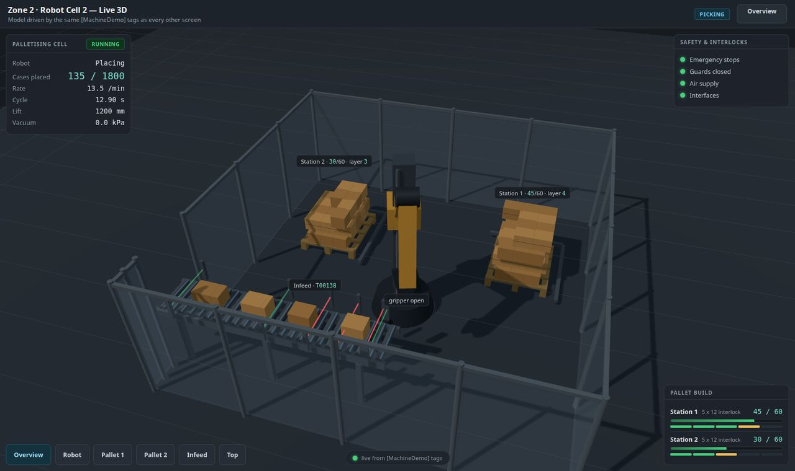
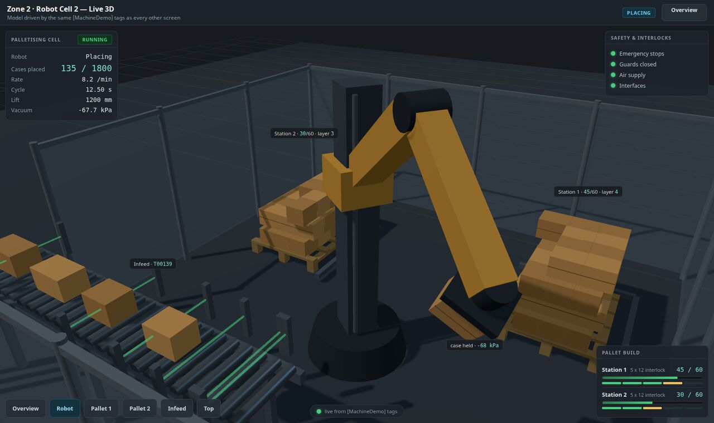
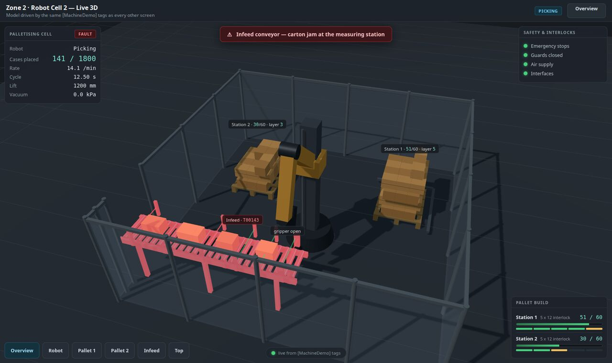
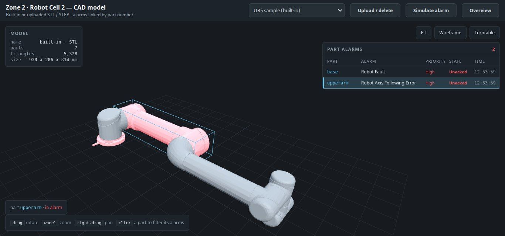

# Machine HMI Demo

**Machine-level operator control in Ignition Perspective — including a live 3D
model of the cell — for machine builders evaluating Ignition as an HMI
replacement.**

> **Not an Inductive Automation product, and not supported by Inductive Automation.** Independent work, largely built with AI tools and tested for one purpose on a limited subset of gateway versions and platforms. Take the ideas; fork and review it before it goes near production. Feedback is welcome in Issues; improvements are made where possible, but no support is guaranteed. [NOTICE.md](NOTICE.md) says more.

## Why this exists

Most Ignition demonstrations look like a dashboard, not the screen an
operator or a fitter stands in front of at a machine. This is a simulated
robotic palletising cell with those screens instead: a line overview, manual
control with permissives and hold-to-run jog, an alarm page, and a 3D view
driven by the same tags as everything else.

Every screen runs on **Ignition Edge Panel** as well as the standard
platform (CAD upload and STEP untested on Edge); one button installs
what the demo needs.

## What it looks like



*The header and state chip are Perspective components bound to tags; the
scene below is a WebGL page served by this project's own WebDev resource.
Both pallets build a real 4×3 interlocked pattern because the robot is
genuinely placing cases.*



*The arm follows five joint tags and a lift position, solved by real inverse
kinematics in the simulator, and is holding a case at -68 kPa of vacuum.
Photo-eye beams along the infeed glow green while clear.*



*One button injects a conveyor jam. The infeed pulses red in the model, the
banner names it in plain words, and the cell status flips to FAULT — so a
fitter knows where to walk before reading anything.*



*The CAD tab with a robot axis fault injected. The two alarms that carry a
part number are listed beside the model and their parts pulse red until
acknowledged; picking a row frames its part. Models are uploaded from the
screen as STL, a zip of STLs, or STEP.*

## What it does

| | |
| --- | --- |
| **3D model rendering** | Robot, infeed, two pallet stations, guarding — animated from live tags, with camera presets, orbit, pinch-zoom and faults highlighted on the geometry. The shape is a parts list edited in the Designer, not code. |
| **Access control by security zone** | The Manual screen is live for maintenance and read-only for an operator, with the reason stated on screen. |
| **Alarming** | Status and journal on the demo's own tag provider, connection and journal profile — acknowledge and shelve included. |
| **Your own CAD on a screen** | The **CAD** tab shows the built-in model or one uploaded from the screen — binary STL, a zip of STLs, or STEP read in the browser — with orbit, zoom, pan and pick. Alarms carrying a `CadPart` part number are listed beside the model and tint their part; any part can take a simulated alarm. No module, no internet. See [docs/CAD-VIEWER.md](docs/CAD-VIEWER.md). |
| **Operator control** | Hold-to-run jog, a permissive list that answers "why won't it move?", service routines, per-zone start/stop. |

| Tab | What it is |
| --- | --- |
| **OVERVIEW** | The line: eight zones, the mimic, per-zone start/stop and the alarm strip. |
| **3D CELL** | The cell in WebGL, animated from live tags, with the Geometry panel. |
| **CAD** | Built-in or uploaded STL/STEP, orbit/zoom/pan/pick, alarms by part number. |
| **MANUAL** | Jog, permissives, service routines, access by security zone. |
| **ALARMS** | Status and journal, this machine only. |
| **SETUP** | One-button install, health checks, and the presenter console. |

## How to use it

Import `build/Machine_HMI_Demo-<version>.zip` in the Designer, then open the
**Setup** page and press the one button. Setup writes 126 tags and 15 alarms
into its own `MachineDemo` tag provider and starts the simulator. What it does
about a database depends on the gateway:

- **Standard Ignition (or Maker)** — also creates a `MachineDemoDB` SQLite
  connection and a `MachineDemo` alarm journal writing into it.
- **Ignition Edge Panel** — has no database connectivity at all: the SQL
  Bridge module is not part of the Edge build, so setup configures the
  `MachineDemo` alarm journal as Edge's own **LOCAL** profile instead — alarms
  are still journalled, with no datasource anywhere.

It all goes through `system.config` and `system.tag.configure`: no config
scan, no restart. Re-running setup is safe.

### Installing on Edge

There are **two release zips** — Edge permits exactly one realtime tag
provider, called `edge` out of the box, so the Edge build is the same project
with the provider name substituted at build time.

| Gateway | Zip |
| --- | --- |
| Standard Ignition, Maker | `Machine_HMI_Demo-<version>.zip` |
| Ignition Edge Panel | `Machine_HMI_Demo_Edge-<version>.zip` |

There is no project import on Edge. Install by copying the unzipped project
over Edge's own project folder (`data/projects/Edge/` by default), `chown` it
to the gateway user, then Config → Platform → Projects → **Scan File
System**. First, change Config → Platform → **Ignition Edge** →
**Visualization Module** from Vision to Perspective, or no Perspective
session opens at all. Then open Setup and press **RUN SETUP**.

---

## Driving it in a meeting

The Setup page doubles as a presenter console, calling the `MachineDemo`
library in-process with nothing to configure. HTTP is **read-only** — every
write verb is refused with 405, credentialed or not. The other way to drive
it is the Designer's Script Console:

```python
MachineDemo.api.setFault("ConveyorJam", True)   # also WrapperFilmFeed VacuumLow GuardOpen RobotAxisFault
MachineDemo.api.reset()                         # steady state
MachineDemo.api.setSpeed(2)                     # simulation speed
MachineDemo.api.setMode("Auto")                 # back to auto
```

## How the 3D page works

Perspective has no native 3D component, so the scene is a WebGL page served
by this project's own WebDev resource, shown in an inline-frame and vendoring
three.js so it works air-gapped. Changing the modelled machine is
[docs/CHANGING-THE-3D-CELL.md](docs/CHANGING-THE-3D-CELL.md); how close it is
to "programmed in Perspective", and the tag/route contract it depends on, are
[docs/3D-AS-PERSPECTIVE.md](docs/3D-AS-PERSPECTIVE.md) and
[docs/CONTRACT.md](docs/CONTRACT.md).

## Layout

| Path | What it is |
| --- | --- |
| `project/` | The Ignition project, as the gateway holds it. Source of truth. |
| `tools/package.sh` | Builds the importable zip; stamps Title/Description. README-gated (`--skip-readme-check` bypasses). |
| `docs/CONTRACT.md` | Tag contract, WebDev routes, the frozen `?cmd=state` shape, the robot's kinematic convention. |
| `docs/CHANGING-THE-3D-CELL.md` | The three levels at which the modelled machine can change. |
| `docs/REAL-DATA.md` | What changes when tags come from a PLC instead of the simulator. |
| `docs/3D-AS-PERSPECTIVE.md` | How close the 3D view is to a Perspective component, and how to close the gap. |

## Development

Point the repo at your own gateway once (`cp tools/env.example.sh
tools/env.local.sh`, then edit it — gitignored, holds the container name,
projects directory and gateway URL). Deploy and scan:

```bash
source tools/env.local.sh
cd project && tar cf - . | docker exec -i "$GW_CONTAINER" \
  tar xf - -C "$GW_PROJECTS/Machine_HMI_Demo"
../tools/scan.sh
```

`chown` the files you wrote to the account the gateway runs as, never
`chown -R` the whole projects directory — that stops every scan silently.
Pull the gateway's copy back over `project/` before editing; the gateway is
the source of truth.

Throwaway gateways per edition live in `dockers/edge/` (:8388) and
`dockers/standard/` (:8488). The gates in `tools/verify/` take the gateway URL
as their first argument and the project name in `$MHD_PROJECT`. Edge Panel
allows one Perspective session, so run Edge gates one at a time, after RESET
DEMO on the Setup page.

## What this demo proves

- The 3D library and the STEP reader are served from the project, not a CDN.
- The robot never solves an impossible pose — checked against the arm's reach.
- Hold-to-run jog is a real momentary bit: release stops the axis dead.
- An open guard circuit disables the jog button independently of the screen.
- Colour is spent only on the abnormal: a running line reads grey, a fault is
  the only saturated thing on screen.
- It survives a gateway restart unattended, no step to re-run.
- The 3D and CAD pages resolve their own project name at runtime, so they
  work under any project name, including every Edge.
- `tools/package.sh` gates the release zip on archive integrity, file count
  and a resource-manifest pass — a resource the gateway silently never scans
  still "imports successfully" without them.
- Meets WCAG 2.1 AA except Perspective's own limits, gated per release.

## Licensing

Licensed **Apache-2.0** — see [LICENSE](LICENSE). Vendors three third-party
works, licences in [NOTICE](NOTICE): `three.min.js` (MIT), occt-import-js
and the OpenCASCADE it is built from, for STEP (LGPL-2.1; OCCT adds the Open
CASCADE exception), and the sample UR5 meshes (BSD-3-Clause, from
[ros-industrial/universal_robot](https://github.com/ros-industrial/universal_robot)
— delete them and drop your own in). That package's UR20/UR30/UR15/UR18
meshes are **not** BSD.

It runs unlicensed, on the two-hour trial, by design. An expiry does not look
like an outage: Perspective and WebDev return **HTTP 402** while
`/StatusPing` still reports `RUNNING`, so check an actual page, not the
health endpoint. A restart resets the trial too, and the demo survives one
unattended.
