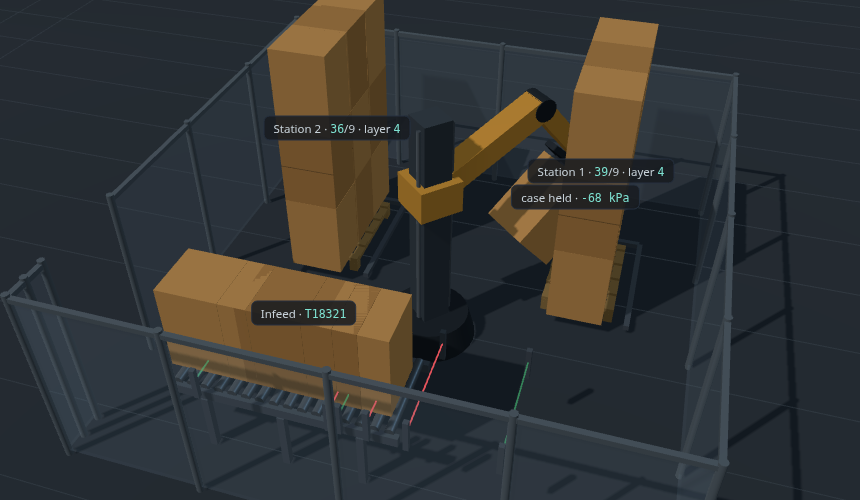

# Changing the 3D cell

*How much of this machine is data, how much is code, and what it actually
takes to make it represent something else.*

The honest summary: **the shape of the machine is 15 numbers, and the numbers
are tags.** Changing them redraws the cell — bigger cases, a different pallet,
a shorter conveyor, stations in different places — with no source edit and no
JavaScript.

There is one important limit, in [The catch](#the-catch) below, and it is the
first thing to read if you intend to change a value live in front of someone.

---

## The three levels

| | What changes | What you edit | Who can do it |
| --- | --- | --- | --- |
| **1** | The machine's proportions | 15 tags in `[MachineDemo]Config` | anyone with the Designer |
| **2** | The arrangement of parts | one block of `page.html` | anyone who can read the block |
| **3** | A different machine entirely | the same block, more of it | someone comfortable with three.js |

---

## Level 1 — the proportions are tags

`[MachineDemo]Config` holds the cell's dimensions in whole millimetres:

```
CaseW_mm  CaseD_mm  CaseH_mm             the case being handled
PalletW_mm  PalletD_mm  PalletH_mm       the pallet it goes on
CasesPerLayer  Layers                    the pattern
ConvHeight_mm  ConvLength_mm  ConvWidth_mm    the infeed conveyor
Station1_X_mm  Station1_Z_mm             where pallet station 1 sits,
Station2_X_mm  Station2_Z_mm             measured from the robot base
```

Every one has engineering limits and a tooltip describing what it means, so
the Designer's tag editor will not let you type a 6-metre case.

**The path a number takes.** Tag → the `admin?cmd=state` endpoint, which
returns them as a `config` block → the page's `metricsFromConfig()`, which
converts mm to metres → the `M` object → every `box()` and `cyl()` call that
builds the scene.

Nothing in that chain is special. You can see the middle of it yourself:

```bash
curl -s "<gateway>/system/webdev/Machine_HMI_Demo/admin?cmd=state" | jq .config
```

**Proved, not asserted.** Feeding the page a different set of numbers — 600 mm
drums 900 mm tall, 3 to a layer, 3 layers, on a Euro pallet, with a shorter
wider conveyor — produces a different machine from the same code:



The scene is rebuilt once, at load, from whatever the config says. So after
changing a tag, **reload the page** — the geometry is not re-read on the
polling cycle, deliberately: a machine that changed shape underneath an
operator mid-cycle would be worse than one that needed a refresh.

---

## The catch

**The simulator does not read these tags.** It has its own copy of the same
numbers, as constants in `MachineDemo.plant`:

```python
CASES_PER_PICK = 3
SLOTS_PER_LAYER = 4
CASES_PER_LAYER = CASES_PER_PICK * SLOTS_PER_LAYER      # 12
LAYERS_PER_PALLET = 5
CASES_PER_PALLET = CASES_PER_LAYER * LAYERS_PER_PALLET  # 60
```

Today the two agree, because the tags' *default values* are generated from
those constants — `_geom("CasesPerLayer", P.CASES_PER_LAYER, ...)`. Change a
tag and they stop agreeing, and the disagreement is visible: the picture
draws the new pattern while the arm keeps placing the old one. In the image
above the stations read `39/9` and `36/9` — more cases placed than the new
pattern can hold — and the stacks do not line up with the gripper.

The constants also feed the inverse kinematics: the arm's placement heights
come from `CASE_H_M` and `PALLET_DECK_M`, and the station positions from
`STATION_XZ`. So this affects the dimension tags too, not just the pattern
ones — the arm reaches to where the *constants* say the pallet is, while the
page draws it where the *tags* say.

**What that means in practice.** Level 1 changes the model honestly, and that
is genuinely useful: it is how you show a prospect their own case size on
their own pallet. But it is a picture, not a re-commissioned machine, and it
is not a change to make live in front of someone unless the simulator is
changed to match.

**Closing it** means having the simulator read the same 15 tags at startup
and recompute its derived geometry from them, instead of importing constants.
That is a real piece of work — those constants reach into the kinematics, and
getting it wrong makes the arm grasp at places it cannot reach — but it is
the difference between *the picture changes* and *the machine changes*, and
it is worth doing before anyone claims the second.

---

## Level 2 — the arrangement

The scene is built in one function, `main()`, in `src/cell3d/page.html`. It
reads top to bottom in the order a person would build the cell: floor, grid,
guard fence, conveyor, robot, pallet stations, cases.

It uses two helpers and almost nothing else:

```js
box(w, h, d, material, x, y, z)      // a rectangular part
cyl(rTop, rBottom, h, material, seg) // a round one
```

both in metres, both returning a three.js mesh already positioned. A conveyor
leg is one `box`. A roller is one `cyl`. Moving the fence is changing four
numbers in `FX0, FX1, FZ0, FZ1`.

The robot itself is a chain of nested groups — `baseYaw → carriage → shoulder
→ elbow → wrist → gripper` — which is the same parent/child relationship a
real arm has. Rotating `shoulder` carries everything below it, so the
kinematics are the nesting, not a matrix calculation.

**To change what a part looks like**, find it by name and change its numbers.
**To add a part**, add a `box()` or `cyl()` beside the ones around it.

---

## Level 3 — a different machine

Nothing about the page is palletising-specific except the contents of
`main()`. The plumbing either side of it — the config fetch, the state poll,
the HUD, the damping, the theme palettes, the camera presets — is machine
agnostic.

A different machine means replacing the parts list with a different one and
pointing `applyState()` at whichever tags drive it. The existing file is the
worked example: about 400 lines of the 1250 are the parts, and the rest is
the plumbing you would keep.

---

## Where to edit it

`src/cell3d/page.html` is the source of truth in git. The gateway serves a
**WebDev Text Resource**, which is the same HTML stored as a JSON string —
readable in the Designer under Web Dev, editable there in a text editor with
a content type of `text/html`.

```bash
python3 tools/webdev_page.py build      # src/cell3d/page.html -> the resource
python3 tools/webdev_page.py extract    # the resource -> src/cell3d/page.html
```

**Run `extract` after editing in the Designer**, before committing, or the
next `build` overwrites what you typed there. That is the one rule the split
imposes.
